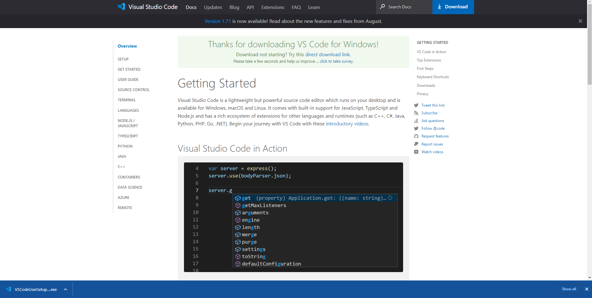
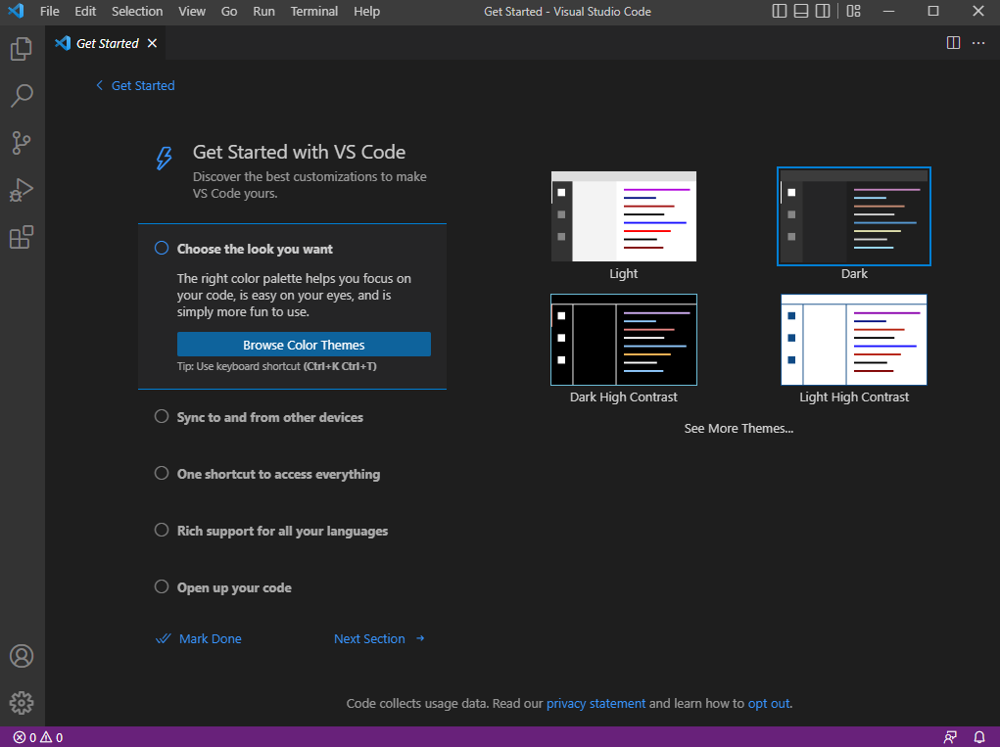
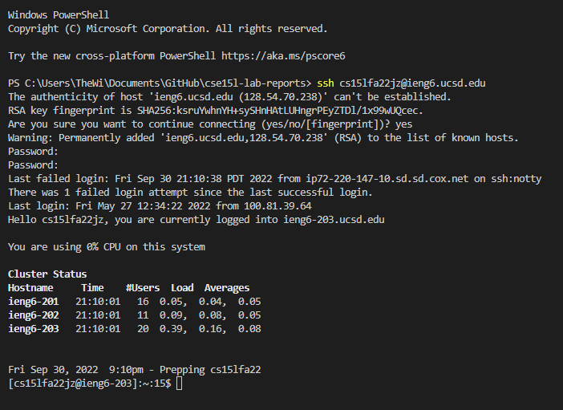

# How to Log Into a Course-Specific Account on **ien6**:

## Step 1

- Head to Visual Studio Code's website to download and install as their instructions show. These steps vary depending on your operating system.

## Step 2

- With VSCode now installed, open a terminal using CTRL or Command +, (Depending on Computer,) or go to terminal page in the upper left hand corner and select new terminal.

## Step 3

* Now that you're in a terminal, type SSH followed by cs15lfa22(your class-specific name)@ieng6.ucsd.edu to make first contact. After prompting for a password, which you should've previously set up for this class-specific account, you should now have access to the remote device.

## Step 4
