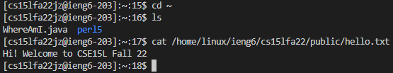
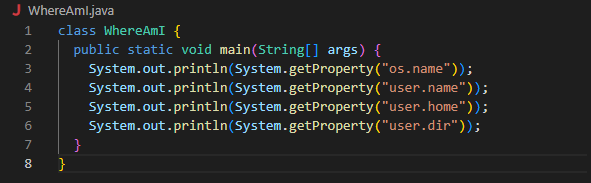
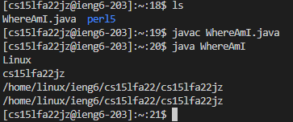
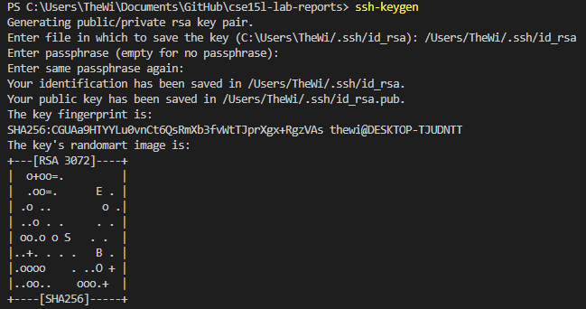
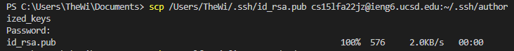
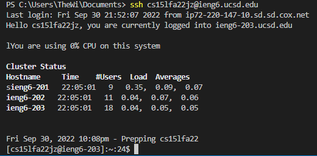
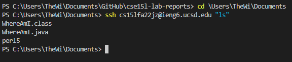

# How to Log Into a Course-Specific Account on **ieng6**:


## Step 1 - Initial Setup


* Head to Visual Studio Code's website to download and install as their instructions show. These steps vary depending on your operating system.

## Step 2 - Getting Started


* With VSCode now installed, open a terminal using CTRL/Command +, (CTRL for Windows, Command for OSX.) Alternatively, you can head to the "Terminal" page in the upper left hand corner and select "New Terminal".

## Step 3 - Accessing the Remote Computer


* Now that you're in a terminal, type "SSH" followed by "cs15lfa22(your class-specific name)@ieng6.ucsd.edu" to make first contact. The "SSH," or "Secure Shell" command esssentially tells your computer, (the client,) to establish a connection with the remote computer using the address you typed.  After prompting for a password, which you should've previously set up for this class-specific account, you should now have access to the remote device!

## Step 4 - Remote Command Examples


* There's many commands available, but here's a few being run as an example.

## Step 5 - Moving a File


* Now let's test moving a file over. Start by creating a new java file called WhereAmI.java. Then, run "scp WhereAmI.java cs15lfa22(class-specific name)@ieng6.ucsd.edu:~/" in the terminal from the directory where you made the file for it to be copied to the remote machine. If the transfer was successful after inputting your password, you should see information on it's progress. See if the file transfered by running ls, and compile and run the program with:

```
javac WhereAmI.java
java WhereAmI
```
* The following should be the result:



* The program has successfully copied over and is running on the remote machine, which is why it gives information about itself rather than ourselves, (the client.)

## Step 6 - Give Your Client a Key to the Remote

* We can continue to use the terminal like this, but it's slow. To create a key to automatically let our client in without a password, first follow the steps below, replacing "jz" and your file directory with your approximate information:



* Now log into the terminal, and create a new directory called `.ssh` using `mkdir`. This is where we'll save the key the client generates. (I couldn't get a screenshot to show this action as I had already made the directory before and got a "directory already exists" error.)

* Lastly, run the following command to send the key into the server:



* If this process worked correctly, you should now not be prompted for a password when accessing the server, as can be seen in this example:



## Step 7 - Example of Convenience with a Keyed Client/Remote

* Last but not least, now that we've let our computer more easily communicate without the barriers of a password, we can run mutiple tasks at the same time using quotations. for example:




That's it! You and your remote computer can now happily co-exist in harmony!!!