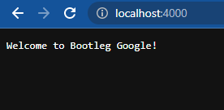
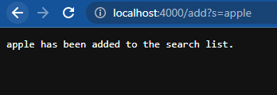
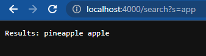
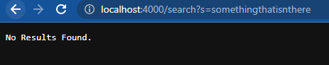
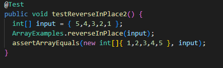
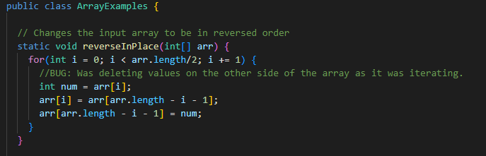
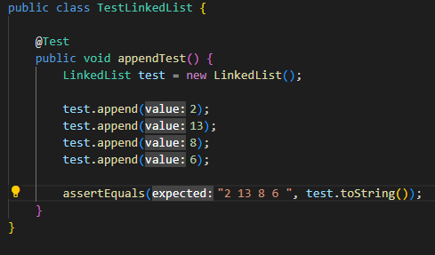
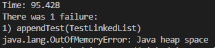
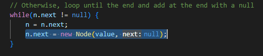

# Creating a Primitive Web Browser and Bug Diagnosing


## Part 1 - Primitive Web Browser

### Code used:

```
import java.io.IOException;
import java.net.URI;
import java.util.ArrayList;


class Handler implements URLHandler {
    // ArrayList to hold possible search results
    ArrayList<String> searchList = new ArrayList<>();

    public String handleRequest(URI url) {

        if (url.getPath().equals("/")) {
            return String.format("Welcome to Bootleg Google!");
        }
        //Search for substring within ArrayList
        else if (url.getPath().contains("/search")) {
            String[] parameters = url.getQuery().split("=");
            if (parameters[0].equals("s")) {

                //Value to store results
                String searchResult = "";
                //Check for substring matches
                for (int i = 0; i < searchList.size(); i++) {
                    if (searchList.get(i).contains(parameters[1])) {
                        //add if there's a match
                        searchResult += searchList.get(i) + " ";
                    }
                }
                //If results were found
                if(searchResult != "") {
                    return "Results: " + searchResult;
                }
                //If no matches were found
                else {
                    return "No Results Found.";
                }
            }
        }
        
        else {
            //Add to search list
            System.out.println("Path: " + url.getPath());
            if (url.getPath().contains("/add")) {
                String[] parameters = url.getQuery().split("=");
                if (parameters[0].equals("s")) {
                    searchList.add(parameters[1]);
                    return String.format("%s has been added to the search list.", parameters[1]);
                }
            }
        }
        return "404 Not Found!";
    }
}

class SearchEngine {
    public static void main(String[] args) throws IOException {
        if(args.length == 0){
            System.out.println("Missing port number! Try any number between 1024 to 49151");
            return;
        }

        int port = Integer.parseInt(args[0]);

        Server.start(port, new Handler());
    }
}
```

### Running Examples and Explanations



* Root page returns a welcome message, which runs from the first if statement in the code if no subpath access is attempted.



* Example of adding a result to the searchlist.

* If "/add?s=" is detected as an input after checking the path, the `paramater[1]` value, (which equals whatever's inputted after "=,") is added to the `searchList` ArrayList using the `.add()` method. the if statement then returns the `parameter[1]` value followed by the message "...has been added to the search list."



* Example of checking for a substring within the list of strings previously added. In this example, randomstring, pineapple, and apple were inputted into `searchList` using /add?s=.

* If "/search?s=" is detected as an input after checking the path, a for loop runs through the length of the ArrayList `searchList` and compares each indexed string to `parameter[1]` using the `.contains()` method. if a match is found, the inputted parameter is added to the string `searchResult` to be saved as part of the final list of results. the final message is then determined on whether the `searchResult` variable was left empty or not. If `searchResult` isn't empty, "Results: " followed by a list of found matches is printed. 



* If no matches were found and `searchResult` was left empty by the for loop, "No Results Found." is printed.

## Part 2 - Diagnosing Bugs

Bug 1
* Failure Inducing Input:



* Symptom:

(Didn't get a screenshot of the original failure message before I fixed the bug, but it was something like: `Array first different at element [0]: expected <1> but was <4>`.)

* Bug:



* Code is fixed here, but the issue was it wasn't remembering the value that was going to be replaced before it erased it with `num`.

Bug 2
* Failure Inducing Input:



* Symptom:



* Bug:



* Bug was caused by the highlighted piece of code, as it caused the class to go into an infinite loop of adding nodes, until it inevitably ran out of memory. A fix would be to simply move it outside of the while loop after the bracket.