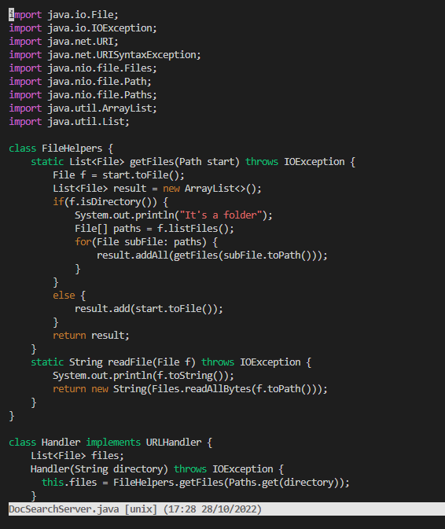
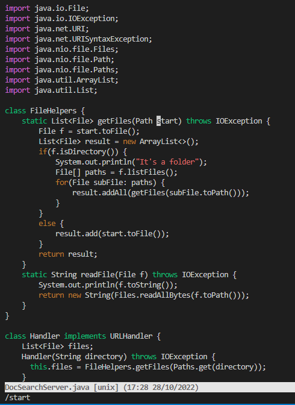
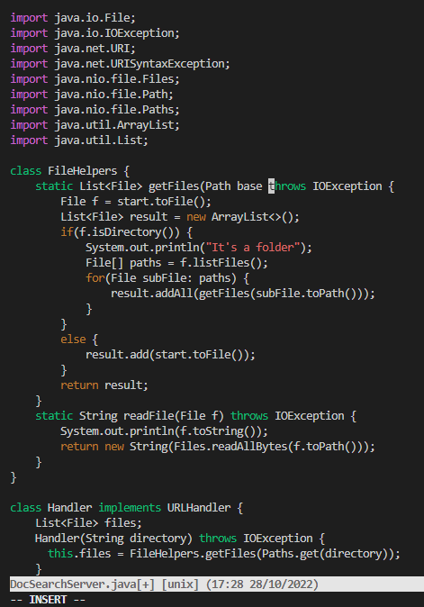
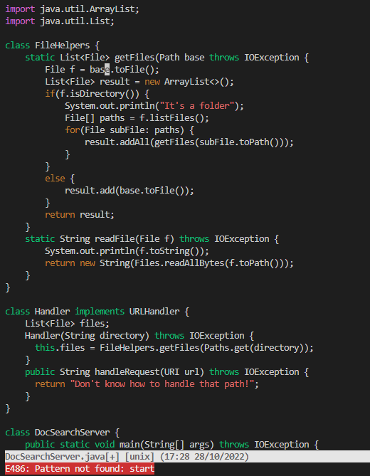
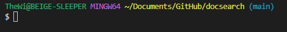

# Vim

## Part 1
### Changing all getFiles parameter names `start` to `base` with Vim
---
Starting at the command prompt in the same directory as DocSearchServer.java:
- First, open the file in Vim with `vim<Space>DocSearchServer.java`.

---

- Now to seach for the variable we're intending to change, enter `/start<Enter>` to tell vim to look for every instance of the inputted string in the file. It will send the cursor to the front of the first instance it finds of start.

---

- Then to relatively quickly delete the string and replace it with something else, type `dwibase<Space><Escape>`. `dw` deletes the word your cursor is at the start of, and `i` allows you to enter Insert Mode, which lets you then type the variable name we intend to use, `base`. Because `dw` moved us all the way up against an adjacent string, type `<Space>` to make room between words, and `Escape` to return to normal mode.

---

- After that, pressing `n` in normal mode jumps us to the next detected match from our previous search, allowing us to repeat `dwibase<Space><Escape>` until all occurences of start are gone, which will be confimed by the message that displays on the bottom of the terminal, which reads: `"Pattern not found: start"`

---

* Finally, to save our changes and quit Vim, type `:wq`. this will bring us back to the command prompt.

  
## Part 2

### Running Vim Locally and Remotely and Questions

---

- Total time after editing locally, SCPing running on the server: **305 seconds**, lost time just waiting for upload and reconnection to the server after editing.
- Total time after editing and running entirely on the server: **148 seconds**, felt more streamlined.

Thoughts after running by both methods:

* The "everything done in the server" method is clearly the way to go if you plan to run code remotely, as I could see it being a pain to make each little edit and having to wait for uploads and reconnections to the server before even being able to test it. And while I'm not totally sold on Vim yet, features like `/` to quickly search for something and others to quickly delete whole strings are very useful tools when time is of the upmost importance.
* If I'm asked to write something that doesn't involve being utilized on a remote PC, then I'd pick VScode any day, but if it neccesitated a remote's utilization, it just makes more sense to do all my edits and changes from the device that's inevitably going to run it. The one main reason I'd still stick to VScode whereever possible though is all the helpful advise it gives you as you code, as I couldn't tell you how many times it's called me out on a mistake before I tried to compile. 