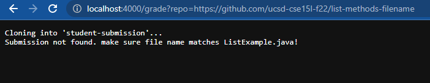

# Grading with Bash Scripts


## Part 1
### My script and examples of it running
---

#### Grade.sh Script
```
#Grading script inspired by groupmate work in Lab!

rm -rf student-submission
git clone $1 student-submission

cp TestListExamples.java student-submission
cp -r lib student-submission
cd student-submission

#Check for file existance/correct name
if [ -e ListExamples.java ]

then
    echo "Found submission"
else
    echo "Submission not found. make sure file name matches ListExample.java!"
    exit 1
fi

#Compile
pwd
javac -cp ".;lib/hamcrest-core-1.3.jar;lib/junit-4.13.2.jar" *.java 2> err.txt

#Check for compile error
if [ $? -eq 1 ]
then
    echo "Compile error!!!"
    cat err.txt
    exit 1
fi

#Run tests
java -cp ".;lib/hamcrest-core-1.3.jar;lib/junit-4.13.2.jar" org.junit.runner.JUnitCore TestListExamples 2> err.txt > out.txt

echo "Compile successful, Tests running..."

#Tally score
FAILS=$(head -n 2 out.txt | tail -n 1 | grep -o "E" | wc -l)
TESTS=$(head -n 2 out.txt | tail -n 1 | grep -o "\." | wc -l)

echo  Tests completed. "$(($TESTS-$FAILS))" tests passed out of $TESTS

exit
```

#### Examples of Grader Running:
1


2


3



## Part 2
### Play-by-Play of the script
---

When testing the student submission `list-methods-compile-error` seen in the second example, the following occurs:

- After downloading the submission and changing to it's directory, the script first checks for the existance of the `ListExamples.java` file with an if statement. This all succeedswithout issue, so the return code is currently zero.
- The if statement goes as true in this case, which runs the `then` statement to give the user a confirmation it was found, and prevents the `else` statement from presenting a nonzero return code.
- The script then prints the working directory for the user to see before attempting to compile. The standard error output is redirected to `err.txt` to be checked.
- In this case because the student submission's code has a compile error, the current return code is now set to 1, which triggers the next `if` statement to print a compile error message, followed by a printout of the standard out saved by `err.txt`.
- Finally the script is exited with a nonzero code to indicate an issue.